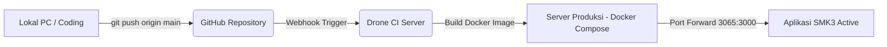

# SMK3 Monitoring - Project Architecture & History

## 📜 Exploration History & Audit Log
Berikut adalah catatan file-file yang telah diperiksa saat menganalisis project ini pertama kali:
* [x] Listed directory `app`
* [x] Listed directory `actions`
* [x] Listed directory `lib`
* [x] Listed directory `admin`
* [x] Listed directory `pegawai`
* [x] Listed directory `components`
* [x] Viewed [audit.ts](file:///d:/TELKOM/WEB-SMK3/app/actions/audit.ts):1-98
* [x] Viewed [auth.ts](file:///d:/TELKOM/WEB-SMK3/app/actions/auth.ts):1-12
* [x] Viewed [user.ts](file:///d:/TELKOM/WEB-SMK3/app/actions/user.ts):1-22
* [x] Viewed [login/page.tsx](file:///d:/TELKOM/WEB-SMK3/app/login/page.tsx):1-177
* [x] Viewed [ibpr.ts](file:///d:/TELKOM/WEB-SMK3/app/actions/ibpr.ts):1-124
* [x] Viewed [kecelakaan.ts](file:///d:/TELKOM/WEB-SMK3/app/actions/kecelakaan.ts):1-82
* [x] Viewed [laporan.ts](file:///d:/TELKOM/WEB-SMK3/app/actions/laporan.ts):1-98
* [x] Viewed [surat.ts](file:///d:/TELKOM/WEB-SMK3/app/actions/surat.ts):1-69
* [x] Listed directory `dashboard`
* [x] Viewed [admin/dashboard/page.tsx](file:///d:/TELKOM/WEB-SMK3/app/admin/dashboard/page.tsx):1-239
* [x] Viewed [admin/layout.tsx](file:///d:/TELKOM/WEB-SMK3/app/admin/layout.tsx):1-36
* [x] Viewed [page.tsx](file:///d:/TELKOM/WEB-SMK3/app/page.tsx):1-25
* [x] Listed directory `monitoring`
* [x] Listed directory `audit`
* [x] Listed directory `ibpr`
* [x] Listed directory `kecelakaan`
* [x] Listed directory `arsip`
* [x] Listed directory `surat`
* [x] Listed directory `users`

---

## 📌 Dokumentasi Sistem & Infrastruktur
Berikut adalah penjelasan lengkap mengenai **infrastruktur**, **struktur folder**, serta **fitur-fitur** dari project **SMK3 Monitoring** ini sebagai panduan pengembangan di masa mendatang.

### 🛠️ 1. Teknologi Utama (Tech Stack)
Project ini dibangun dengan arsitektur modern berbasis Fullstack Javascript dan containerization:
1. **Framework Utama**: **Next.js (v16.1.4)** menggunakan **React 19** dengan folder struktur terbaru **App Router**.
2. **Database ORM**: **Prisma (v5.22.0)** sebagai jembatan object-relational mapping ke database.
3. **Database Engine**: **PostgreSQL** (Port 5432).
4. **Styling**: **Tailwind CSS v4** + **PostCSS** untuk styling modern dan cepat.
5. **Visualisasi Data**: **Recharts** untuk grafik interaktif di halaman dashboard.
6. **Deployment & CI/CD**: 
   * **Docker & Docker Compose** untuk containerization aplikasi.
   * **Drone CI/CD** (`.drone.yml`) untuk otomatisasi deployment dari GitHub ke server produksi (`http://smk3.treg3.com`).

---

### 📁 2. Struktur Folder & Fungsi Kode
Berikut adalah pemetaan file dan folder penting di dalam workspace:

```text
WEB-SMK3/
├── app/                      # CORE APLIKASI (Next.js App Router)
│   ├── actions/              # Server Actions (Fungsi backend/query database)
│   │   ├── audit.ts          # CRUD Laporan Temuan Audit K3
│   │   ├── auth.ts           # Logika logout user
│   │   ├── ibpr.ts           # CRUD Identifikasi Bahaya & Pengendalian Risiko
│   │   ├── kecelakaan.ts     # CRUD Laporan Insiden Kecelakaan Kerja
│   │   ├── laporan.ts        # Upload/Hapus Laporan Bulanan per Witel
│   │   └── surat.ts          # CRUD Arsip Surat (Undangan/Laporan)
│   │   └── user.ts           # Hapus User/Pengguna
│   ├── admin/                # Halaman & Komponen khusus Role ADMIN / AUDITOR
│   │   ├── arsip/            # Halaman Arsip Surat
│   │   ├── audit/            # Halaman Detail Temuan & Tindak Lanjut Audit
│   │   ├── dashboard/        # Dashboard Executive & Grafik Tren Insiden
│   │   ├── ibpr/             # Halaman Formulir & Tabel IBPR
│   │   ├── kecelakaan/       # Monitoring Laporan Kecelakaan Pegawai
│   │   ├── monitoring/       # Monitoring Laporan Bulanan per Witel
│   │   ├── surat/            # Halaman Pembuatan Surat Baru
│   │   ├── users/            # CRUD Manajemen User/SDM K3
│   │   ├── AdminHeader.tsx   # Header atas Panel Admin
│   │   ├── AdminSidebar.tsx  # Menu Navigasi Samping Admin
│   │   └── layout.tsx        # Layout utama Panel Admin
│   ├── pegawai/              # Halaman khusus Role PEGAWAI (Teknisi/Lapangan)
│   │   ├── audit/            # Form Pegawai melaporkan temuan kondisi bahaya
│   │   ├── dashboard/        # Dashboard ringkas Pegawai
│   │   ├── kecelakaan/       # Form Pegawai melaporkan insiden kecelakaan
│   │   └── components/       # Komponen pendukung panel pegawai (Sidebar, NavLink)
│   ├── login/                # Halaman Login
│   ├── globals.css           # Global CSS & Tailwind CSS import
│   ├── layout.tsx            # Root Layout Aplikasi
│   └── page.tsx              # Root Page (Fungsi Routing Otomatis berdasarkan Role)
├── lib/                      # Helper & Utility reusable
│   ├── prisma.ts             # Instansiasi PrismaClient (Database Connection Singleton)
│   └── riskMatrix.ts         # Utility penilaian tingkat risiko untuk IBPR
├── prisma/                   # Konfigurasi Database Prisma
│   ├── migrations/           # Riwayat migrasi database SQL
│   ├── schema.prisma         # Skema Database PostgreSQL (Daftar Tabel)
│   └── seed.ts               # Script data awal (Default users, witel, temuan)
├── public/                   # Asset Static (Gambar, Logo, Icon)
│   └── uploads/              # Folder penyimpanan file fisik hasil upload (Foto APAR, PDF IBPR, dll)
├── .drone.yml                # Pipeline CI/CD untuk otomatisasi deploy ke server
├── Dockerfile                # Konfigurasi Build Image Docker aplikasi
├── docker-compose.yml        # Konfigurasi container dan volume binding di server
├── package.json              # Daftar dependency & script npm
└── .env                      # Kunci koneksi database lokal (sensitif, jangan dipush ke git)
```

---

### 🔑 3. Sistem Autentikasi & Otorisasi (RBAC)
Aplikasi ini menggunakan **Cookie-based Session** yang dikustomisasi sendiri (tanpa library NextAuth di sisi kode aplikasi, melainkan menggunakan cookies bawaan Next.js `next/headers`).

Terdapat 3 jenis peran (**Role**) pengguna yang didefinisikan di database:
1. **ADMIN**: Memiliki akses penuh ke seluruh fitur, manajemen user, arsip surat, IBPR, monitoring witel, dan resolusi laporan kecelakaan.
2. **AUDITOR**: Memiliki akses ke halaman audit untuk melihat dan memvalidasi temuan di lapangan.
3. **PEGAWAI**: Memiliki akses terbatas untuk melaporkan temuan bahaya lapangan (Audit K3) dan melaporkan kecelakaan kerja (Insiden) melalui panel pegawai.

#### ⚠️ Temuan Bug Logika Redirect untuk Developer:
* Di [app/login/page.tsx](file:///d:/TELKOM/WEB-SMK3/app/login/page.tsx#L30), jika login sukses sebagai **PEGAWAI**, aplikasi me-redirect ke `/pegawai/dashboard`.
* Namun, di [app/page.tsx](file:///d:/TELKOM/WEB-SMK3/app/page.tsx#L15) (jika user mengakses root URL `/` saat sudah masuk), aplikasi mencoba me-redirect **PEGAWAI** ke `/lapor`. Folder `/lapor` **tidak ada** di dalam project, sehingga akan menghasilkan halaman *404 Not Found*.
* **Solusi/Tugas Pengembangan Depan**: Ubah baris `redirect('/lapor')` di [app/page.tsx](file:///d:/TELKOM/WEB-SMK3/app/page.tsx#L15) menjadi `redirect('/pegawai/dashboard')`.

---

### 🌟 4. Fitur-Fitur Utama Aplikasi

#### A. Dashboard Executive & Tren Insiden (Recharts)
* Menampilkan ringkasan statistik (Total User, Total Temuan Audit Open, Total Insiden Kecelakaan, dan Total Dokumen IBPR).
* Grafik tren kecelakaan per bulan sepanjang tahun berjalan menggunakan chart library `Recharts`.

#### B. Audit SMK3 & Temuan Lapangan
* **Pelaporan**: Pegawai dapat melaporkan temuan (contoh: *APAR Kadaluarsa*, *Kabel Terkelupas*) disertai deskripsi, lokasi, waktu temuan, tingkat kategori (`KRITIKAL`, `MAYOR`, `MINOR`), kondisi (`AMAN`, `BUTUH_PERBAIKAN`), dan bukti foto.
* **Logika Otomatis**: Jika kondisi diset ke `AMAN`, status temuan otomatis `CLOSED`. Jika diset `BUTUH_PERBAIKAN`, status otomatis `OPEN` (membutuhkan tindak lanjut).
* **Tindak Lanjut**: Admin/Auditor dapat memperbarui status temuan menjadi `IN_PROGRESS` atau `CLOSED` setelah diperbaiki, serta menentukan deadline perbaikan.

#### C. Pelaporan Kecelakaan Kerja (Insiden K3)
* Pegawai dapat mengirim laporan kecelakaan kerja secara realtime (kronologi kejadian, korban, lokasi, tanggal/jam, dan foto bukti).
* Admin menerima laporan ini di dashboard dan dapat memprosesnya hingga selesai dengan menekan tombol **Selesai** (mengubah status dari `OPEN` ke `CLOSED`).

#### D. Monitoring Laporan Bulanan (Witel)
* Menghubungkan 8 Wilayah Telekomunikasi (Witel) di Regional 3 (Suramadu, Solo Jateng Timur, Semarang Jateng Utara, Yogya Jateng Selatan, Jatim Timur, Jatim Barat, Bali, Nusa Tenggara).
* Admin dapat memonitor status pengumpulan dokumen bulanan setiap witel berdasarkan tahun dan bulan.
* File diupload ke folder `public/uploads` dan nama filenya disimpan di database. Jika laporan dihapus oleh admin, aplikasi akan menghapus entri database serta menghapus file fisik di server agar penyimpanan efisien.

#### E. Pembuatan & Arsip Surat (Format Flexible JSON)
* Fitur untuk membuat dan mengarsipkan dokumen dinamis (contoh: Surat Undangan atau Laporan K3).
* Menggunakan kolom tipe data **`Json`** di database Prisma agar struktur data surat bersifat fleksibel tanpa perlu mengubah tabel database setiap kali ada template surat baru.

#### F. IBPR (Identifikasi Bahaya & Pengendalian Risiko)
* Modul wajib K3 untuk mendaftarkan titik bahaya ruangan.
* Admin dapat memasukkan data lokasi ruangan, aktivitas kerja, potensi bahaya, peluang risiko, penanganan/mitigasi, serta mengupload foto kondisi ruangan dan dokumen PDF panduan K3 terkait.

---

### 🚀 5. Alur Deployment & Infrastruktur Server
Aplikasi ini dideploy dengan alur **Automated GitOps** menggunakan Drone CI/CD:



1. **Drone CI (`.drone.yml`)**:
   * Setiap kali kamu melakukan `git push` ke branch `main`, server Drone CI akan mendeteksi perubahan tersebut.
   * Drone akan otomatis menyalin source code terbaru ke folder project di server (`/root/smk3-monitoring`).
   * Membuat file `.env` di server secara otomatis yang mengarah ke database PostgreSQL utama.
   * Menjalankan perintah Docker Compose untuk mematikan container lama, membersihkan cache (`docker system prune`), membangun container baru (`docker compose up -d --build`), dan menyalakan aplikasi di port `3065`.
2. **Multi-Stage Dockerfile**:
   * **Stage 1 (deps)**: Mengunduh library NPM.
   * **Stage 2 (builder)**: Menghasilkan Prisma Client, men-compile script, dan melakukan build Next.js ke mode produksi.
   * **Stage 3 (runner)**: Menjalankan migrasi database otomatis (`npx prisma migrate deploy`), menjalankan database seeder (`node prisma/seed.js`), lalu menyalakan server produksi Next.js.
3. **Persistent Volume Binding**:
   * Folder `public/uploads` di-binding ke harddisk fisik server asli melalui docker-compose. Hal ini memastikan file foto/PDF yang diupload user tidak hilang saat container Docker di-restart atau di-build ulang ketika ada update code.
